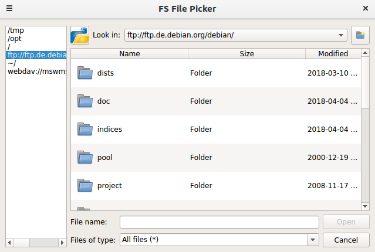

fs_filepicker
~~~~~~~~~~~~~

|Source| |Coveralls| |Platforms| |Downloads| |License| |Documentation|

.. |Source| image:: https://img.shields.io/badge/source-GitHub-303030.svg?maxAge=300&style=flat-square
   :target: https://github.com/open-mss/fs_filepicker

.. |Platforms| image:: https://anaconda.org/conda-forge/fs_filepicker/badges/platforms.svg
   :target: https://anaconda.org/conda-forge/fs_filepicker

.. |Downloads| image:: https://anaconda.org/conda-forge/fs_filepicker/badges/downloads.svg
   :target: https://anaconda.org/conda-forge/fs_filepicker   

.. |License| image:: https://anaconda.org/conda-forge/fs_filepicker/badges/license.svg
   :target: https://choosealicense.com/licenses/apache-2.0/

.. |Coveralls| image:: https://coveralls.io/repos/github/Open-MSS/fs_filepicker/badge.svg?branch=develop
   :target: https://coveralls.io/github/Open-MSS/fs_filepicker?branch=develop

.. |Documentation| image:: https://readthedocs.org/projects/fs_filepicker/badge/?version=latest
   :target: https://fs-filepicker.readthedocs.io/en/latest/?badge=latest

This project is based on `PyFilesystem2 <http://pyfilesystem2.readthedocs.io/>`_
As fs_url you can enter any valid url which the fs.open_fs accepts.

Example for commandline::

   ~$: fs_filepicker -h
   usage: fs_filepicker [-h] [-v] [-s] [-d DEFAULT_NAME] [-u FS_URL]
                        [-f FILE_PATTERN] [-t TITLE]
   optional arguments:
     -h, --help            show this help message and exit
     -v, --version         show version
     -s, --save            show save button
     -d DEFAULT_NAME, --default_name DEFAULT_NAME
                           default name for saving
     -u FS_URL, --fs_url FS_URL
                           fs url to filesystem
     -f FILE_PATTERN, --file_pattern FILE_PATTERN
                           file pattern
     -t TITLE, --title TITLE
                           title of window

   ~$: fs_filepicker -u ftp://ftp.de.debian.org/debian

Examples for PyQt5::

  from PyQt5 import QtWidgets
  app = QtWidgets.QApplication([])
  from fslib.fs_filepicker import getOpenFileName, getSaveFileName, getExistingDirectory, getOpenFileNameAndFilter, \
                                  getSaveFileNameAndFilter
  filename = getOpenFileName(parent=None, fs_url=u'~/', file_pattern=u'All Files (*)',
                           title=u'Open Config File')
  print(filename)

  patterns = [u'All Files (*)', u'Config Files (*.json)']
  filename = getSaveFileName(parent=None, fs_url=u'~/', file_pattern=patterns,
                             default_filename=u'config.json',
                             title=u'Save Config File')
  print(filename)

  dirname = getExistingDirectory(parent=None, fs_url=u'~/')
  print(dirname)

  patterns = [u'Data Files (*.xml)', u'Config Files (*.json)']
  filename, pattern = getOpenFileNameAndFilter(parent=None, fs_url=u'~/', file_pattern=patterns)
  print(filename, pattern)

  patterns = [u'Data Files (*.xml)', u'Config Files (*.json)']
  filename, pattern = getSaveFileNameAndFilter(parent=None, fs_url=u'~/', file_pattern=patterns)
  print(filename, pattern)

  def load_file(self):
      from fslib.fs_filepicker import getOpenFileName
      filename = getOpenFileName(self, fs_url=u'ftp://ftp.de.debian.org/debian', file_pattern=u'All Files (*)',
                                 title=u"Debian files")

